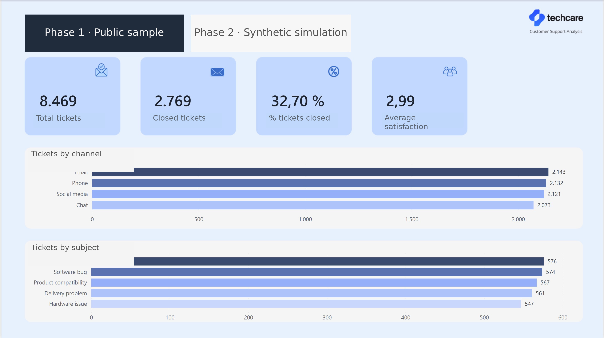
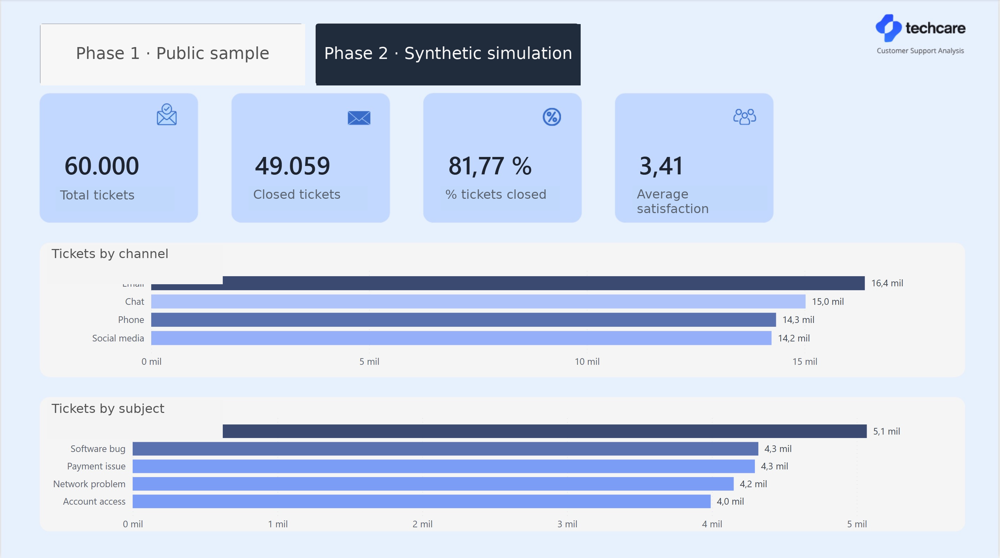
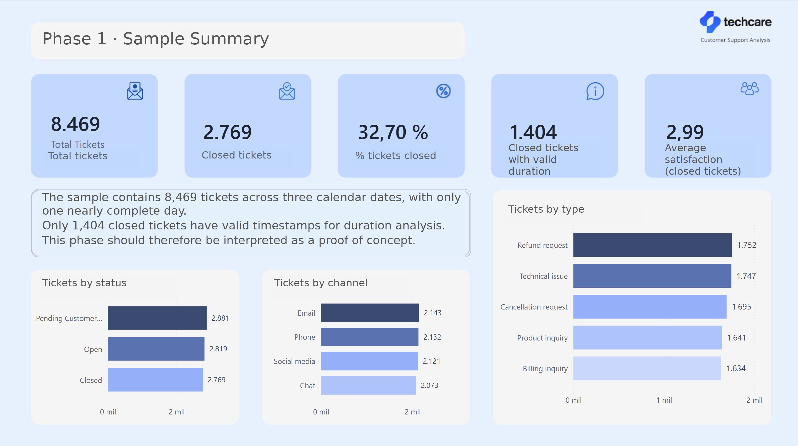
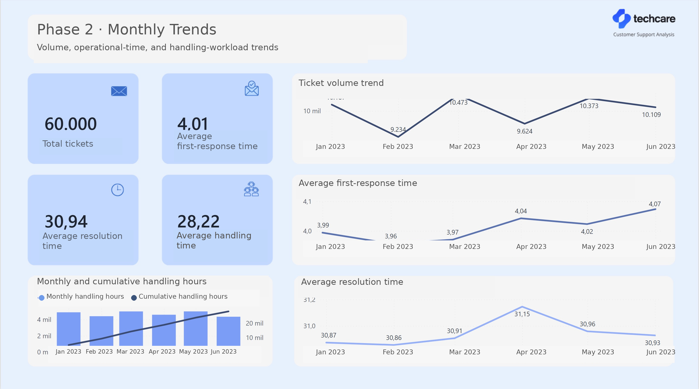
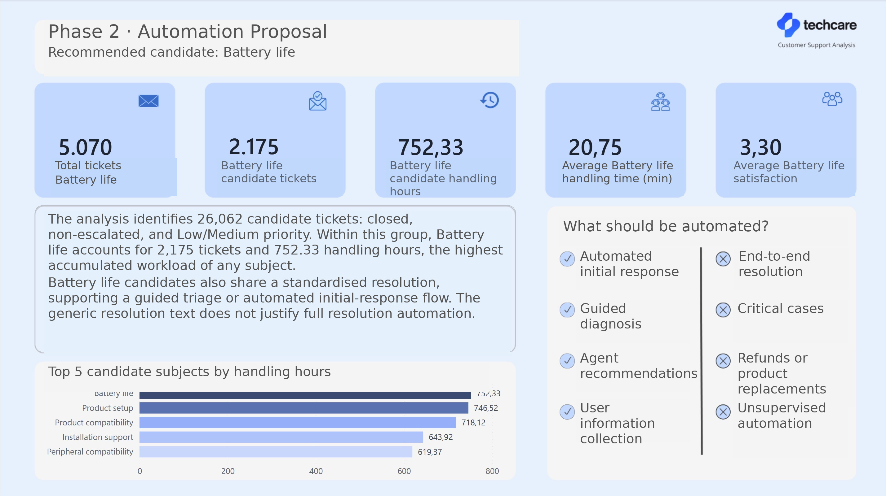

# TechCare: Support Ticket Analysis and Automation Opportunities

**Language:** English | [Español](README_ES.md)

An end-to-end data analytics project that identifies customer-support categories worth evaluating for partial automation by combining ticket volume, priority, operational effort, and evidence of standardisation.

The project integrates **Python**, **MySQL**, and **Power BI** in a reproducible workflow covering data preparation, dimensional modelling, validation, analysis, and reporting.

> **Main finding:** `Battery life` is the strongest candidate for a controlled automation pilot. In the operational simulation, it accounts for 2,175 candidate tickets and 752.33 agent handling hours. A hypothetical 20% reduction would release 150.47 hours of capacity. This is a pilot assumption, not a demonstrated financial saving.

## Business Problem

A multichannel support team needs to decide which enquiries should be evaluated first for future automation. Prioritising by volume alone may lead to automating complex, critical, or poorly standardised cases.

This analysis uses four criteria to support a more cautious decision:

- ticket volume;
- Low or Medium priority;
- operational effort;
- repetition and potential standardisation.

Automation is treated as a **hypothesis to validate**, not as an automatic conclusion from the data.

## Objectives

- Assess the quality and limitations of the available data.
- Design a dimensional model that supports two phases with different structures.
- Identify ticket subsets suitable for an automation pilot.
- Quantify operational effort without confusing cycle time with direct agent labour.
- Build a dashboard that connects evidence, limitations, and recommendations.

## Data

The project uses two datasets with different analytical roles:

| Phase | Records | Nature | Purpose |
|---|---:|---|---|
| Phase 1 | 8,469 | Public support-ticket sample | Initial exploration and hypothesis development |
| Phase 2 | 60,000 | Six-month synthetic dataset | Method demonstration and operational simulation |

### Data-quality considerations

- Only 2,769 Phase 1 tickets are closed.
- Only 1,404 closed Phase 1 tickets have timestamps in a valid order for duration analysis.
- Phase 1 does not provide sufficient temporal coverage for reliable trend analysis.
- Phase 2 is synthetic and does not constitute external validation of the hypothesis.
- Missing values associated with open, pending, or non-escalated tickets are retained as structural nulls rather than imputed without a business rule.

### Privacy and data provenance

- The public Phase 1 data used in this repository is anonymised.
- Phase 2 is entirely synthetic and is used only to demonstrate the analytical method.
- The notebooks do not expose real personal data.
- Source and generated CSV files are excluded from the repository. The notebooks, model, and validation scripts document the workflow without redistributing the datasets.

## Workflow


### Python

- Inspect structure, data types, duplicates, and missing values.
- Convert and validate dates.
- Check temporal consistency and numeric ranges.
- Prepare MySQL-compatible output files.
- Reload each export and confirm row counts, columns, identifiers, and null values.

### MySQL

- Create source tables.
- Build a dimensional model with two fact tables.
- Use conformed dimensions for phase, subject, product, and channel.
- Add Phase 2 dimensions for date, agent, and team.
- Centralise automation-candidate rules in reusable views.
- Validate uniqueness, referential integrity, and row-count reconciliation.
- Use CTEs, window functions, and aggregations for business analysis.

### Power BI

- Integrate both phases in one report.
- Use DAX measures for operational indicators and time intelligence.
- Present comparison, diagnosis, trends, and prioritisation.
- Provide controlled navigation and slicer behaviour.
- Connect the automation proposal to limitations and pilot recommendations.

## Analytical Model

Two fact tables are retained because the phases do not share the same schema or temporal quality:

- `fact_tickets_fase1` retains all 8,469 tickets and identifies the 1,404 valid durations.
- `fact_tickets_fase2` retains all 60,000 tickets and adds operational timestamps, agents, teams, and escalation information.

Phase, subject, product, and channel are conformed dimensions. The date dimension is actively related to the Phase 2 creation date. Agent and team are separate dimensions because the same agent may appear across multiple teams.

The views `vw_candidatos_fase2` and `vw_battery_life_candidatos` prevent the candidate-selection rules from being duplicated across SQL, DAX, and report visuals.

> The validated model retains several original Spanish schema identifiers and category values as a stable technical contract with the Power BI semantic model. Public documentation, code comments, query outputs, notebook narratives, report pages, and file names are presented in English.

## Key Results

### Phase 1: initial exploration

| Metric | Result |
|---|---:|
| Total tickets | 8,469 |
| Closed tickets | 2,769 |
| Closed tickets with valid duration | 1,404 |
| Average valid duration | 7.58 h |
| Average satisfaction for closed tickets | 2.99/5 |

`Battery life` received the highest exploratory score when volume, priority, duration, and satisfaction were combined. Phase 1 supports hypothesis development, but its limited temporal coverage cannot support a reliable operational-impact estimate.

### Phase 2: operational simulation

| Metric | Result |
|---|---:|
| Total tickets | 60,000 |
| Closed tickets | 49,059 |
| Average first-response time | 4.01 h |
| Average resolution time | 30.94 h |
| Average agent handling time | 28.22 min |
| Average satisfaction | 3.41/5 |

The candidate rule selects closed, non-escalated tickets with Low or Medium priority:

| Prioritisation result | Value |
|---|---:|
| Phase 2 candidate tickets | 26,062 |
| Associated handling hours | 9,463.95 h |
| `Battery life` candidate tickets | 2,175 |
| `Battery life` handling hours | 752.33 h |
| Average handling time per ticket | 20.75 min |
| Average satisfaction | 3.30/5 |
| Hypothetical 20% reduction | 150.47 h |

Repeated resolution text and description patterns support the standardisation hypothesis. However, textual similarity alone does not prove that the real resolution procedure is identical in every case.

## Dashboard

### Phase overviews

| Phase 1 overview | Phase 2 overview |
|---|---|
|  |  |

| Phase 1 sample summary | Phase 2 monthly trends |
|---|---|
|  |  |

### Phase 2 automation proposal



## Repository Structure

```text
techcare-analytics/
├── .gitignore
├── README.md
├── images/
│   ├── 01_phase1_overview.jpg
│   ├── 02_phase2_overview.jpg
│   ├── 03_phase1_summary.jpg
│   ├── 04_phase2_monthly_trends.jpg
│   └── 05_phase2_automation_proposal.jpg
├── notebooks/
│   ├── 01_phase1_preprocessing.ipynb
│   └── 02_phase2_preprocessing.ipynb
├── powerbi/
│   └── techcare_support_analytics.pbix
└── sql/
    ├── 01_database_setup.sql
    ├── 02_dimensional_model.sql
    ├── 03_business_views.sql
    ├── 04_data_quality_checks.sql
    └── 05_analysis_queries.sql
```

## Reproducing the Project

### Requirements

- Python with `pandas` and a Jupyter-compatible environment.
- MySQL 8.x.
- Power BI Desktop.

### Execution order

1. Place the source files next to the notebooks using the filenames expected by each notebook.
2. Run `01_phase1_preprocessing.ipynb` and `02_phase2_preprocessing.ipynb` from top to bottom.
3. Run `01_database_setup.sql` against a new schema.
4. Load the CSV files generated by the notebooks into the source tables.
5. Run `02_dimensional_model.sql`, `03_business_views.sql`, `04_data_quality_checks.sql`, and `05_analysis_queries.sql` in that order.
6. Open `techcare_support_analytics.pbix` and update the local MySQL connection or credentials if the model needs to be refreshed.

CSV paths and credentials are not included because they depend on the local environment.

## Validation

The controlled SQL execution confirmed:

- 8,469 Phase 1 rows and 60,000 Phase 2 rows, with no loss when building the fact tables;
- zero duplicate identifiers, unmatched keys, or duplicated dimension values;
- 26,062 Phase 2 candidates;
- 2,175 `Battery life` candidates;
- 752.33 handling hours and an average satisfaction score of 3.30 for that subset.

Both notebooks were also run from a restarted kernel and completed without errors before translation. The translated versions preserve the executable code and validated outputs while presenting their narrative and validation labels in English.

## Limitations

- Phase 1 has insufficient temporal coverage and contains reversed timestamps in some closed tickets.
- Phase 2 is synthetic: it demonstrates the method but does not confirm impact in a real operation.
- Text similarity cannot replace a review of procedures, risks, and case-level exceptions.
- The 20% scenario represents potential capacity, not a financial estimate.
- Any automation decision would require validation of accuracy, security, escalation behaviour, customer experience, and pilot outcomes.

## Recommendation

Run a limited pilot for Low- or Medium-priority `Battery life` enquiries, using a guided initial response and immediate escalation when the case is critical, exceptional, or requires technical diagnosis.

The pilot should compare an assisted group with a control group and measure at least:

- resolution without additional intervention;
- agent handling time;
- reopen rate;
- subsequent escalations;
- customer satisfaction;
- incorrect or unsafe responses.

Only after this validation should the real operational or financial impact be estimated.
